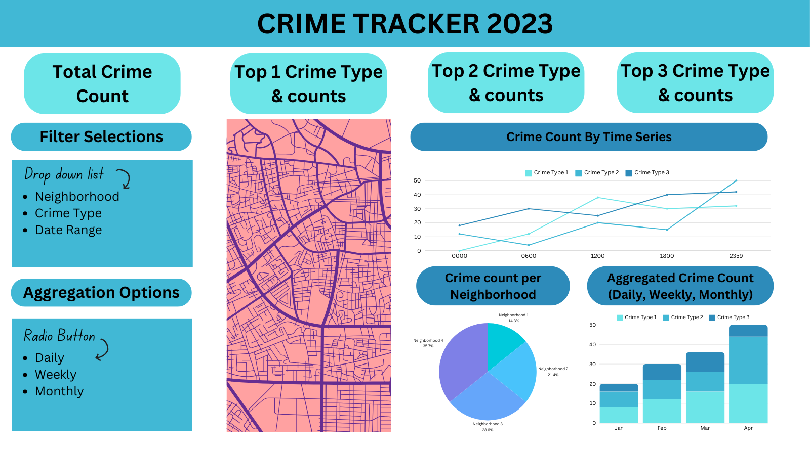

# Milestone 1 - Dashboard proposal(Vancouver Crime Tracker)

## 1. Motivation and purpose
Our role: Data scientist consultancy firm

Target audience: Law enforcement administrators and policymakers for the Vancouver Police Department

 The Vancouver Police Department plays a crucial role in ensuring public safety and maintaining the quality of life within the city.  A comprehensive understanding of crime patterns is essential for effective policing and strategic resource allocation. Our "Crime Tracker" dashboard is designed to support law enforcement administrators by offering a clear, analytical view of crime data across various key dimensions such as location, time, and crime categories.

This tool facilitates a data-driven approach to law enforcement, allowing for informed decisions on where and when to deploy resources. Reflecting the concerns of the community, recent surveys have indicated a growing concern among Vancouver residents regarding their safety, with 74% of downtown residents believing that crime has gotten worse. Leveraging the power interactive visualizations, the dashboard helps identify trends and hotspots, enabling administrators to prioritize areas that require immediate attention and plan preventive measures.

With the "Crime Tracker," the Vancouver Police Department can enhance their operational efficiency, responding decisively to the dynamic landscape of urban crime, ultimately striving for a safer community.

## 2. Description of the data
We will be analyzing a subset of a dataset focused on crimes in Vancouver, sourced from GeoDASH, which extracts data from the PRIME BC Police Records Management System (RMS). The primary dataset contains approximately 1,000,000 records spanning all Vancouver neighborhoods from 2003 to the present. Our subset comprises 5,099 records from 2023, covering seven selected neighborhoods.
The dataset consists of 10 variables, which can be classified into three main categories:
1. Temporal Variables: These include Year, Month, Day, Hour, and Minutes, providing detailed timestamps for each reported crime.   
2. Spatial Variables: This category encompasses Neighborhoods, Hundred_Block, Latitude, and Longitude, offering geographical information about where each crime occurred.  
3. Type: Denoting the category of crimes reported.
Leveraging the combination of temporal and spatial data can yield valuable insights for effective urban planning and crime reduction strategies. Law enforcement agencies require a comprehensive overview of crime occurrences over time and location to facilitate swift and informed decision-making. The dataset's variables empower them to respond promptly, ultimately contributing to the safety of city residents.
We intend to derive additional variables from the dataset to enhance our understanding of the situation, some of which will be integrated into our dashboard:
- Aggregate Crime Counts by Neighbourhood or Hundred Block: Identifying crime hotspots by aggregating incidents within specific geographic areas.
- Aggregate Statistics: Calculating counts, averages, or sums of crimes over different time intervals (e.g., daily, weekly, monthly) to discover patterns and trends.
- Proximity Analysis: Determining the distance from key locations such as police stations, schools, or parks to assess their impact on crime rates.
- Temporal Analysis: Extracting features from the datetime columns, such as day of the week or time of day (morning, afternoon, evening, night), to uncover temporal patterns in crime occurrence.
- Weather Integration: Incorporating weather data (e.g., temperature, precipitation) into the analysis to explore potential correlations between weather conditions and crime rates.
- Crime Rate Calculation: Estimating the rate of crime based on the population of each neighborhood to provide context for crime occurrences.

## 3. Research questions and usage scenarios

Adam Palmer is a Chief Constable at the Vancouver Police Department in British Columbia and he has come to understand that many of the citizens living in Vancouver feel extremely unsafe stepping foot outside their homes. Therefore, he wants to understand what is causing this perception, and how he can effectively manage the resources at his disposal to reduce the crimes in Vancouver. He wishes to be able to take a glance at a holistic overview of the crime data and determine which types of crimes should be targetted and what times he should be allocating most of his patrols.

When Adam logs into our "Crime Tracker app", he will see an overview of the variables available in our dataset, according to the number of crimes being committed for different categories, the times at which they were committed and the neighbourhoods in which they were commited. He can then filter-out different types of crimes, or the neighbourhoods or time, to make comparisons to determine which areas of resource allocation would be most effective for crime reduction. When he does so, Adam may perhaps notice that there seems to be a greater count of "robberies/snatchings" being committed at "night" in "Hastings"

Based on his findings from using our app, Adam hypothesizes that in order to reduce snatch/grab/run crimes, a reduction in which would make the population of Vancouver feel safe, he can allocate greater resources for patrolling in Hastings at night, in an attempt to reduce crimes there.

## 4. App sketch and description

The app interface is designed as a single-page dashboard, offering users a comprehensive view of the crime rate in Vancouver for the year 2023. At the topmost section of the page, users can immediately observe the total crime rate in Vancouver, accompanied by three summary statistics highlighting the top three most common crime types along with their respective counts. This provide users with a quick overview of the overall crime landscape in the city.

Moving down the page, users encounter a filtering section located on the left side. They are presented with dropdown lists enabling them to narrow down the dataset based on specific criteria. Users can select particular crime types, neighborhoods, and date ranges to filer the data accordingly. Additionally, radio buttons allow user to choose the aggregating level for the displayed distributions, providing flexibility in how they analyze the data - whether on a daily, weekly, or monthly basis.

The main section of the dashboard presents four distinct distributions of the crime rate, influenced by the filtering selection made by the user. Positioned centrally within the dashboard is an interactive spatial heatmap visually representing the density of crime rates across different neighborhoods in Vancouver. This heatmap allows users to explore spatial pattern of crime distribution and discern areas with higher or lower crime rates within the city.

On the right side of the dashboard, users can examine the temporal distribution of the crime rate, illustrating how crime rates of specific crime type fluctuate hourly. This temporal perspective enables user to detect any seasonal trends within the data. At the bottom right corner is a pie chart displaying the distribution of crime counts by neighborhood, offering a comparative view of crime prevalence across different areas. Meanwhile, a stacked bar chart presents the aggregated crime count per crime type, allowing user to identify the relative frequencies of various types of crimes within the dataset.

The dashboard incorporates interactive elements, such as tooltips, to enhance the user experience. These tooltips provide users with detailed statistical information when hovering over specific data points. Overall, the dashboard offers users a powerful tool for exploring and understanding the crime landscape in Vancouver.

